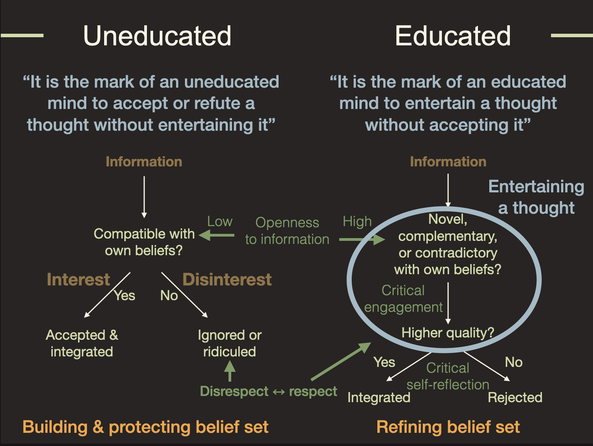

# Domestication in times of conspiracy theory

Many people who stress the importance of "do your own research" are referred to as 'conspiracy theorists'. Why is that the case? The reason for it might be simpler and more logical than you think.

Suppose someone is unable to "do their own research"? Doing your own research assumes that you are 1) able to approach a body of data, beliefs, and opinions, 2) generate a your own conclusions from engaging with the material, and 3) adopt these conclusions independently of authority support. 

This is a tall order. 

What many people do when asked to do their own research is to search for a source that they consider authoritative and then they adopt – mimic – the conclusions of their authority. This entails that the content matter of the research domain is **not** engaged with. The conclusion and arguments of the authoritative source is adopted wholesale and the subject matter is therefore avoided. 

If the avoidance of subject-matter is structural, the person will have no choice then to defer to authority supported opinions whenever asked. They want to know whether a source is credible because they cannot determine the credibility of subject matter themselves. 

* Mish-mash of authority supported opinions, beliefs, data without access to the subject matter (other than endorsed by the authority)
* Total inability to self-generate 

This is a strategy that makes sense if one does not trust the own decision making and trusts the decision-making of the authoritative source sufficiently. 

It all has to do with a phenomenon called self-direction. Self-direction is the self-acquired ability to prefer your own decision-making over the decision-making of others. Wild animals typically need to be self-deciders since there is no one else to tell them what to do. They are their own authority. 

Human self-directors, as the name suggest, not only direct their own behaviors, but, more importantly, they themselves decide what knowledge they take as reliable and productive enough to base their behaviors on and they develop self-direction over time. Interestingly, they implement the features of the educated mind described by Perry (1998). He writes that the educated mind

> has learned to think about even his own thoughts, it examines the way it orders his data and the assumptions it is making, it compares these with other thoughts that other people might have
and adopts whatever this scrutiny of data, ideas, and opinions decides on as most reliable and productive.
In doing so the educated mind learned to think in accordance with reality from which position he can take responsibility for his own stand and negotiate – with respect – with others.

This is a rich description of how the educated mind decides on what to fill its mind with. Characteristically, they continually think about the quality and realism of their own thoughts. This allows them to continually improve the basis for their own decision making. The continually search for knowledge, perspectives, and skill that can improve their interactions with the world. The better they become in this, the higher demands they place on data, ideas, and opinions as candidates for acceptance. This make them highly respectful of the knowledge others and especially when these others can add new perspectives that help to update and improve the own knowledge. The combination of well-developed meta-cognition and a highly develop mental quality assurance entails that generally foresee the consequences of their behaviors and hence can take responsibility for their actions. And because all these self-deciders follow individual development paths they become ever less alike while developing their competences.  

Not all wild animals are self-directors. Herd animals are not, since they have to decide on behavior within the constraints of a functioning herd. Herd animals have to decide on and contribute to some sort of consensus and then not only submit to the consensus, but actively help to maintain it. Among herd animals the consensus functions as authority. Of course some individuals, typically the more experienced ones, contribute more to the consensus  because they know more about effective herd strategies than the inexperienced members. 

The form of cognition to allow herd members to function optimally is quite different from the cognition that self-deciders need. Herd members, whether human or nor, need to protect the integrity of the herd – oneness – and ensure a high level of coordinated behavior – sameness – that serves the herd. So they need to become ever more similar and ever better herd members. And where self-directors self-develop their competencies and become more diverse, good herd members ensure oneness and sameness through social mimicry of its most successful herd members and remain quite similar to other herd members. 

Effective herd members believe the ideas and express the habits that ensure herd oneness and sameness. Where self-deciders optimize Individual effectivity (agency), effective and proper herd members put their agency in the service of the herd. This entails that they unconditionally accept the data, beliefs, and opinions that emerge as consensus and when the consensus changes they adapt accordingly simply because deviating from the consensus is inconsistent with being a good herd member. 

<!-- This is different for young mammals that all spend considerable time with their mother while they breast feed. Depending on the species, mothers, fathers, siblings, extended family members, or even unrelated conspecifics play a role in teaching the young in the ways of the world before the young are old enough to be independent self-directors who do no longer need external supervisors to guide or decide their behaviors.-->

<!-- For domesticated -- tame -- animals the situation is different. Their master or owner -- an authority -- decides what they eat, where they sleep and live, who they mate, when they die, and in general how they benefit the owner. Domestication entails self-direction in only the less important choices of life. But it can still lead to high animal welfare provided that the master/owner takes good care of them. And it will be clear that full self-direction is not beneficial for a tame animal. <!-- On the contrary, self-direction frustrates the control of the authority over its flock and will not normally lead to a better situation for the pets.For the pet, -> Something similar is holds for herd animals. These have to decide on and contribute to some sort of consensus and then not only submit to the consensus, but actively help to maintain it. Here the consensus functions as authority. --> 

Uneducated thinkers are not self-deciders and instead follow a mental logic similar to the domesticated or herd animals. The domesticated thinker 

Something similar is holds for herd animals. These have to decide on and contribute to some sort of consensus and then not only submit to the consensus, but actively help to maintain it.

A way to implement this is reflected in Aristole's dictum: 

> It is the mark of an educated mind to entertain a thought without accepting it. 
> – Aristotle

Educated minds play with (entertain) data, ideas, and opinions before they accept them as reliable and productive. And when they do they accept them only until they find more reliable and productive  data, ideas, and opinions. This leads to an ever-improving knowledge base for self-direction. Essentially they, and no one else, decide what they accept as reliable and productive.   

This can be contrasted to the dictum of the uneducated mind that can be formulated as follows

> It is the mark of an uneducated mind to accept a thought without entertaining it. 

Uneducated minds do not entertain thoughts – i.e., they do not decide on whether they are reliable and productive – but accept or refute thoughts using another criterion, namely compatibility with the own beliefs and authority support. This entails that when data, ideas, and opinions have the (perceived) support of their authorities, they will accept the beliefs as true irrespective of whether the ideas are more reliable or productive. 

The uneducated mind 

> has not learned to think about  his own thoughts, it does not examine the way it orders his data and the assumptions it is making, it does not compare these with other thoughts that other people might have
> and does not adopt whatever this scrutiny of data, ideas, and opinions decides on as most reliable and productive.
> In doing so the uneducated mind never learnes to think in accordance with reality and cannot take responsibility for his own stand and nor negotiate – with respect – with others.





# Self-direction is self-acquired

# Plans Tjeerd

* Make CC material
  * Short intro: 20-60 sec
  * More blogs
    * Florence blogs: polarization
  * Interview researchers
    * Berzonsky
    * Via Florence: Deeyah Khan
      * ​		

# Plans Florence

- Write at least two more papers
- Security concept as ‘radicalisation’
    - Normative identity style as an explanation of the terrorist mindset
    - Database of extremism
- Safety concept as ‘de-radicalisation’
    - Guaranteed failure of counter-terrorism policies as they operate solely from the normative worldview.

- Write a blog on polarisation - perhaps use vaccines as example
- Write a blog on ‘male packs’ - kults, armies, frats, and terror cells  
- Write a blog of ‘agreeable extremism’ - sheeple extremism

- Incels are the culture of diffusions
- Terrorist are all normative because all of them
    - Say that they are correct, there needs to be change/killed.

# Flo studies

* Total feedback fits on 2 pages A4
  * Whether you were an active or inactive contributor was hardly noticed and not taken into account.
* No feedback at all on her as a budding academic.
* Not worth the €2000,-
* However the Master degree will open new avenues for her (monopoly of Universites)
* Write the paper with me was way more valuable that the whole master. Although the master material provides input to the papers.
* Unlike the whole of het Liberal Art bachelor, she was always unsure what was expected of her. In the bachelor she knew when she was doing well off not, here she was always unsure about whether her teachers would give her work the attention it deserved, or that it would be evaluated superficially.
* Characteristically superficial response to her request for dispensation to receive a cum laude.
